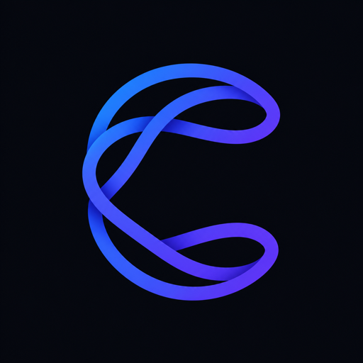

# code-council



[](https://github.com/akathpal/code-council/actions/workflows/ci.yml)
[](LICENSE)

**Better code through collective intelligence.**

code-council gives Codex and Claude reusable, Graphify-guided repository
context and lets them propose, critique, revise, and execute an approach before
you accept the resulting patch.

It builds on two open-source dependencies:

- [OpenHands Agent Canvas](https://github.com/OpenHands/agent-canvas) provides
  the local agent runtime and Agent Server foundation.
- [Graphify](https://github.com/Graphify-Labs/graphify) builds the structural
  code graph used to retrieve relevant files, symbols, and dependencies.

## Why it improves results and reduces token usage

Coding agents normally spend part of every task rediscovering repository
structure, dependencies, conventions, and important files. code-council does
that work incrementally and reuses the result:

1. Graphify builds a structural index of the repository without an LLM call.
2. A selected context agent creates persistent, source-linked Markdown memory
   for architecture, modules, conventions, risks, and important symbols.
3. For each task, Graphify finds the relevant files and relationships.
4. code-council sends the agent a bounded task capsule containing only the
   relevant graph evidence and memory instead of the entire generated context.
5. After accepted changes, only affected context is refreshed.

This can reduce repeated repository exploration, keep prompts smaller, and
avoid duplicate context across council stages. In council mode, the capsule is
sent to the proposer once; critique and revision reuse the structured proposal
and inspect source selectively. Small tasks stay with one agent, so code-council
does not pay for a council when it is unlikely to help.

Results improve because agents begin with repository-specific evidence rather
than a generic or incomplete view of the task. For complex changes, Claude and
Codex have distinct propose, critique, revise, and execute roles. This makes it
more likely that dependency impacts, missing tests, unsafe assumptions, and
alternative approaches are identified before editing begins. Deterministic
verification and human diff review remain the final checks.

Savings depend on the repository and task, so code-council records selected
context, input and output tokens, latency, and outcomes per task. You can run
the same task with context enabled and disabled to measure the difference.

## Built with Codex and GPT-5.6

I used Codex with GPT-5.6 as a development partner to build code-council. Codex
helped me explore the codebase, compare architectural approaches, implement the
React/TypeScript interface and Node.js companion service, diagnose Git and
state-management issues, write tests and documentation, and verify the running
application in the browser. I directed the product decisions, reviewed the
changes, and iterated on the implementation through real task runs.

Codex and GPT-5.6 are also used inside code-council:

- Small questions and coding tasks can run directly through Codex.
- In council mode, Codex critiques Claude's proposal before Claude revises it.
- Codex implements the reviewed plan in an isolated Git worktree.
- Codex/GPT can generate persistent repository context from Graphify evidence.
- The UI exposes Codex commands, approvals, token usage, latency, and limits.

The default Codex configuration is GPT-5.6 Sol (`gpt-5.6-sol`) with high
reasoning. You can choose any other model and reasoning level reported by your
installed Codex CLI. Changes stay isolated until you review and accept the
diff.

## Install

### Requirements

- macOS or Linux
- Git
- Node.js 22.13 or newer
- [`uv`](https://docs.astral.sh/uv/)
- [Codex CLI](https://github.com/openai/codex)
- [Claude Code](https://code.claude.com/docs/en/getting-started) for council mode

Install Graphify for graph-based repository retrieval:

```bash
uv tool install 'graphifyy>=0.8.22,<1'
```

Clone and start code-council:

```bash
git clone https://github.com/akathpal/code-council.git
cd code-council
npm ci
npm start
```

Open [http://localhost:3000](http://localhost:3000).

On first start, `uvx` downloads the pinned OpenHands Agent Server. Later starts
reuse the local cache. Graphify runs locally against each connected repository;
it does not use a model to build the structural graph.

If an agent is not authenticated, sign in with its CLI and refresh the app:

```bash
codex login
claude auth login
```

Use one command to stop an existing code-council process and start it again:

```bash
npm run restart
```

Press `Ctrl+C` in the terminal to stop code-council.

## Test it on a local repository

1. Start code-council and open [http://localhost:3000](http://localhost:3000).
2. Click **Connect repository** and enter the absolute path to any local Git
   repository. code-council does not delete or relocate the repository.
3. Click **Build context**. Choose Codex or Claude plus the model and reasoning
   level. Graphify indexes repository structure, and the selected agent creates
   reusable Markdown memory under `agent_context/`.
4. Wait for context generation to finish. The job continues in the background
   if the browser is refreshed.
5. Start with a read-only question:

   ```text
   Explain how an incoming request moves through this repository. Identify the
   main entry points, important modules, and relevant tests. Do not modify files.
   ```

6. Try a small direct Codex task:

   ```text
   Add one focused regression test for an existing edge case in this repository.
   Follow the current test conventions and do not change production behavior.
   ```

7. Try council mode on a larger task:

   ```text
   Review the error-handling path in this repository and improve one concrete
   weakness. Have Claude propose the approach, Codex critique it, Claude revise
   the plan, and Codex implement it. Run the relevant tests and show the diff
   before applying anything.
   ```

8. Use **Conversation** for the readable task narrative, **Monitor** for exact
   commands and processes, **Memory** for retrieved context and token usage, and
   **Environment** for the branch, worktree, and change summary.
9. Open the diff and choose **Accept**, **Decline**, or **Request changes**.
   Accepted changes are applied only after a patch preflight check.

To compare the value of repository context, run the same task twice: once with
the task-level **Context** toggle enabled and once with it disabled. Compare
tokens, latency, selected context, test results, and the final diff in each task.

## Verify the project

```bash
npm run lint
npm test
```

Repository content may be sent to the provider configured by your Codex or
Claude CLI. Review [SECURITY.md](SECURITY.md) before using private code.

code-council is open source under the [MIT License](LICENSE).
