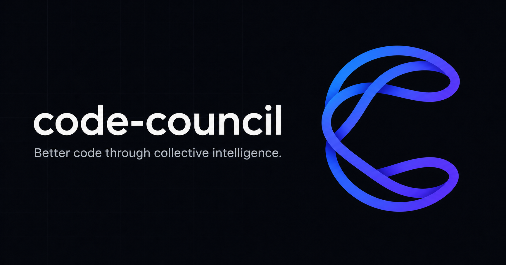

# code-council



[](https://github.com/akathpal/code-council/actions/workflows/ci.yml)
[](LICENSE)

**Better code through collective intelligence.**

code-council gives Codex and Claude reusable, Graphify-guided repository
context and lets them propose, critique, revise, and execute an approach before
you accept the resulting patch.

It builds on two open-source dependencies:

- [OpenHands Agent Canvas](https://github.com/OpenHands/agent-canvas) provides
  the local agent runtime and Agent Server foundation.
- [Graphify](https://github.com/Graphify-Labs/graphify) builds the structural
  code graph used to retrieve relevant files, symbols, and dependencies.

## Why it improves results and reduces token usage

Coding agents normally spend part of every task rediscovering repository
structure, dependencies, conventions, and important files. code-council does
that work incrementally and reuses the result:

1. Graphify builds a structural index of the repository without an LLM call.
2. A selected context agent creates persistent, source-linked Markdown memory
   for architecture, modules, conventions, risks, and important symbols.
3. For each task, Graphify finds the relevant files and relationships.
4. code-council sends the agent a bounded task capsule containing only the
   relevant graph evidence and memory instead of the entire generated context.
5. After accepted changes, only affected context is refreshed.

This can reduce repeated repository exploration, keep prompts smaller, and
avoid duplicate context across council stages. In council mode, the capsule is
sent to the proposer once; critique and revision reuse the structured proposal
and inspect source selectively. Small tasks stay with one agent, so code-council
does not pay for a council when it is unlikely to help.

Results improve because agents begin with repository-specific evidence rather
than a generic or incomplete view of the task. For complex changes, Claude and
Codex have distinct propose, critique, revise, and execute roles. This makes it
more likely that dependency impacts, missing tests, unsafe assumptions, and
alternative approaches are identified before editing begins. Deterministic
verification and human diff review remain the final checks.

Savings depend on the repository and task, so code-council records selected
context, input and output tokens, latency, and outcomes per task. You can run
the same task with context enabled and disabled to measure the difference.

## Built with Codex and GPT-5.6

I used Codex with GPT-5.6 as a development partner to build code-council. Codex
helped me explore the codebase, compare architectural approaches, implement the
React/TypeScript interface and Node.js companion service, diagnose Git and
state-management issues, write tests and documentation, and verify the running
application in the browser. I directed the product decisions, reviewed the
changes, and iterated on the implementation through real task runs.

Codex and GPT-5.6 are also used inside code-council:

- Small questions and coding tasks can run directly through Codex.
- In council mode, Codex critiques Claude's proposal before Claude revises it.
- Codex implements the reviewed plan in an isolated Git worktree.
- Codex/GPT can generate persistent repository context from Graphify evidence.
- The UI exposes Codex commands, approvals, token usage, latency, and limits.

The default Codex configuration is GPT-5.6 Sol (`gpt-5.6-sol`) with high
reasoning. You can choose any other model and reasoning level reported by your
installed Codex CLI. Changes stay isolated until you review and accept the
diff.

## Council IDE

The repository now includes a thin Code-OSS workbench layer under
[`ide/`](ide/README.md). It turns the existing local runtime into an editor
experience without rewriting the trusted task engine:

- **Council** opens the multi-agent Agent Manager, including stop, steer,
  restart, goals, skills, worktrees, cost, evidence, and GitHub workflows.
- **Codex** opens the separately installed official Codex extension.
- **Claude Code** opens the separately installed official Claude Code
  extension.
- Editor selections and diagnostics can be handed to a prefilled Council task.
- A status-bar attention indicator tracks running work and tasks that need
  clarification, approval, review, or recovery.

Build and package the extension:

```bash
npm run ide:build
npm run ide:package
```

The package is written to `ide/build/council.vsix`. Council IDE uses Open VSX,
where Codex and Claude Code are published under verified restricted namespaces.
The provider extensions are referenced as an extension pack and opened as
separate experiences; code-council does not redistribute their VSIX binaries.
See the [Council IDE guide](ide/README.md) for preparing a Code-OSS checkout.

## Install

### Requirements

- macOS or Linux
- Git
- Node.js 22.13 or newer
- [`uv`](https://docs.astral.sh/uv/)
- [Codex CLI](https://github.com/openai/codex)
- [Claude Code](https://code.claude.com/docs/en/getting-started) for council mode

Install Graphify for graph-based repository retrieval:

```bash
uv tool install 'graphifyy>=0.8.22,<1'
```

Clone and start code-council:

```bash
git clone https://github.com/akathpal/code-council.git
cd code-council
npm ci
npm start
```

Open [http://localhost:3000](http://localhost:3000).

On first start, `uvx` downloads the pinned OpenHands Agent Server. Later starts
reuse the local cache. Graphify runs locally against each connected repository;
it does not use a model to build the structural graph.

Make sure the active shell is using Node.js 22.13 or newer before installing or
starting code-council:

```bash
node --version
```

If `npm start` fails while importing `glob` from `node:fs/promises`, an older
Node.js executable is still first on `PATH`. Switch to Node.js 22.13 or newer,
run `npm ci` again, and restart. If `uv --version` invokes a sandboxed Snap that
cannot run, install the official standalone `uv` binary instead and confirm
that its install directory appears before `/snap/bin` on `PATH`.

On Ubuntu 20.04, the Cloudflare `workerd` binary cannot run against the
system's glibc 2.31. If Docker and the Docker Compose plugin are installed,
`npm start` detects this automatically and runs only the web runtime in a
Debian Bookworm container. The local companion, OpenHands, repository paths,
and agent CLI logins continue to run on the host. The first start downloads the
Node image and installs the web dependencies into Docker-managed volumes, so it
takes longer than later starts.
If a healthy code-council web container is already running, later launcher
starts reuse it instead of attempting a conflicting recreation; the source
workspace remains bind-mounted for development updates.

Override runtime selection when troubleshooting:

```bash
COUNCIL_WEB_RUNTIME=container npm start
COUNCIL_WEB_RUNTIME=native npm start
```

The supported values are `auto` (the default), `container`, and `native`.
Container mode uses Linux host networking and is intended for older Linux
hosts. Pressing `Ctrl+C` stops the attached container with the other
code-council services.

If an agent is not authenticated, sign in with its CLI and refresh the app:

```bash
codex login
claude auth login
```

Use one command to stop an existing code-council process and start it again:

```bash
npm run restart
```

Stop all services from another terminal:

```bash
npm run stop
```

Press `Ctrl+C` in the terminal to stop code-council.

### Check your setup

Run the non-mutating Setup Doctor before connecting a repository:

```bash
npm run doctor
```

It checks the required Node.js, Git, `uv`, Graphify, and Codex setup, plus the
optional Claude Code, GitHub CLI, and OpenHands integrations. Every failed or
optional check includes a concrete repair command. Use JSON output in scripts:

```bash
node bin/council.mjs doctor --json
```

The same report is available from the **Doctor** button beside **Local
runtime** in the app.

## Test it on a local repository

1. Start code-council and open [http://localhost:3000](http://localhost:3000).
2. Click **Connect repository** and enter the absolute path to any local Git
   repository. code-council does not delete or relocate the repository.
3. Click **Build context**. Choose Codex or Claude plus the model and reasoning
   level. Graphify indexes repository structure, and the selected agent creates
   reusable Markdown memory under `agent_context/`.
4. Wait for context generation to finish. The job continues in the background
   if the browser is refreshed.
5. Start with a read-only question:

   ```text
   Explain how an incoming request moves through this repository. Identify the
   main entry points, important modules, and relevant tests. Do not modify files.
   ```

6. Try a small direct Codex task:

   ```text
   Add one focused regression test for an existing edge case in this repository.
   Follow the current test conventions and do not change production behavior.
   ```

7. Try council mode on a larger task:

   ```text
   Review the error-handling path in this repository and improve one concrete
   weakness. Have Claude propose the approach, Codex critique it, Claude revise
   the plan, and Codex implement it. Run the relevant tests and show the diff
   before applying anything.
   ```

8. Use **Conversation** for the readable task narrative, **Monitor** for exact
   commands and processes, **Memory** for retrieved context and token usage, and
   **Environment** for the branch, worktree, and change summary.
9. Open the diff and choose **Accept**, **Decline**, or **Request changes**.
   Accepted changes are applied only after a patch preflight check.

The composer is optimized for active development:

- Press **Enter** to send and **Shift+Enter** for a newline.
- Clicking back into the composer closes open model, skill, context, and GitHub
  menus so typing is never obscured by configuration UI.
- Use the persistent **Stop** control beside the composer to interrupt an active
  agent. Type into the same composer to steer a running Codex or Claude turn
  through the provider's native streaming interface; older provider versions
  fall back to a linked stop-and-restart attempt with the update.
- Failed or stopped tasks can retry the failed stage, restart from the
  beginning, or use **Edit & restart** to revise the objective first.
- Agent conversations persist across turns. Codex threads and Claude sessions
  are resumed instead of rebuilding the entire conversation on every reply.

For reusable workflows, open **Skills** beside the agent picker. The catalog is
filtered to the selected routing strategy and labels each workflow as Codex or
Claude. Auto mode lets each active provider discover its own repository, user,
plugin, admin, or built-in skills. Explicit mode records selections with the
task, sends Codex skills as typed app-server inputs, and preloads Claude skills
through a task-scoped native agent configuration.

Enable **Goal** for longer coding objectives. Goal mode stores the objective,
provider thread, worktree, token budget, progress, and continuation history.
It can be paused, resumed after an app restart, edited, or cleared. Automatic
continuation is bounded by both the selected token budget and a per-run safety
limit; it does not expand the task's sandbox or approval policy. Codex uses
thread goals and Claude uses its native `/goal` evaluator loop. Both providers
retain their local session and isolated worktree across pause and resume.

When the connected repository has a GitHub origin and `gh` is authenticated,
the **GitHub** workspace in the top bar lists open issues and pull requests,
including review and check summaries. Start an issue as a bounded goal, review
a pull request, or create a fix task for failing checks. Accepted patches can
still be committed, pushed, and opened as draft pull requests from
**Environment**.

To compare strategies or the value of repository context, enter a request and
click **Compare**. The same automatic intent classifier used by normal sends
decides whether the request is a read-only repository question or a coding
task—there is no extra mode selector. Read-only comparisons run Codex and Claude
against the same source snapshot without worktrees or patches. Coding
comparisons run isolated variants from the same base SHA and remain
review-gated. The parent tab displays calls, tokens, context tokens, agent time,
the selected model and intelligence snapshots, and the relevant answer or patch
evidence side by side. Choose the Codex and/or Claude model and supported
intelligence level inside each variant before starting the comparison. Use
**Open run** to
inspect each child conversation (`C01`, `C02`, and so on) and **Back to
comparison** to return to its parent task.

If a run asks an irrelevant clarification, choose **Dismiss without rerun**.
The run is closed and its history is preserved without calling an agent,
changing repository files, or consuming more model quota.

## Verify the project

```bash
npm run lint
npm test
```

Repository content may be sent to the provider configured by your Codex or
Claude CLI. Review [SECURITY.md](SECURITY.md) before using private code.

code-council is open source under the [MIT License](LICENSE).
