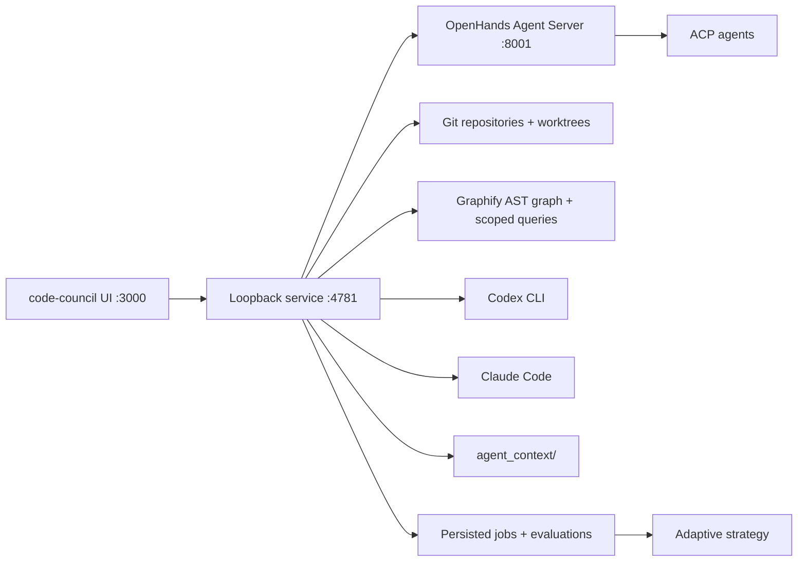
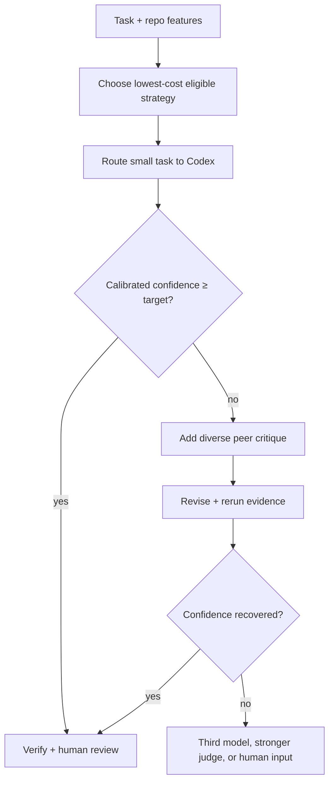

# code-council architecture

## Product boundary

code-council is a local workflow layer over OpenHands Agent Canvas and Agent Server.
It does not replace Codex or Claude Code. It supplies:

- guided installation and native authentication for Codex CLI and Claude Code;
- local-folder and Git repository connections;
- workspaces and isolated git worktrees;
- incremental, evidence-linked Markdown in `agent_context/`;
- configurable propose → critique → revise councils with optional deeper debate;
- confidence-gated escalation;
- benchmark and human-review analytics.

Repository investigation is configurable between Claude Code and Codex/GPT,
with a persisted model and reasoning selection; the default is Claude Opus 4.8
at high effort. code-council planning uses Codex plus Claude Code, and Codex executes
the resulting plan. OpenHands Agent Server is the pinned local runtime
foundation; ACP-compatible agents remain extensible execution backends.

## Primary user flow

1. `npm start` launches Agent Canvas in backend-only mode, the code-council
   loopback service, and the simple code-council web UI.
2. The local companion detects `codex` and `claude`.
3. For a missing CLI, the UI previews an official OS-specific install command.
   The runner executes only the exact allowlisted command after explicit user
   approval, then hands authentication to the native CLI.
4. The user chooses a local folder or Git URL.
5. [Graphify](https://github.com/Graphify-Labs/graphify) updates a local,
   deterministic AST graph before semantic memory generation. The user chooses
   Claude Code or Codex/GPT plus a model and
   reasoning level for repository investigation. The agent runs read-only and
   returns structured documents that code-council validates and writes into
   `agent_context/`: repository, module, convention, risk, and per-symbol
   Markdown plus a hash manifest. The context job is persisted locally and can
   be recovered by the UI after a browser reload.
6. Every prompt creates or continues a durable task conversation. code-council
   deterministically separates ordinary questions from change requests and
   reports the result in the task: chat is repository-aware and read-only,
   while code changes are isolated and review-gated. The user chooses Codex
   only, Claude only, or code-council; automatic model escalation remains opt-in
   rather than silently spending council tokens.
7. If a coding request is underspecified, code-council pauses the task in
   `awaiting_input` before editing. Codex and Claude can also return a
   structured clarification request from any later stage. The answer is stored
   in that task's conversation and the durable run resumes with the additional
   constraint.
8. Chat never creates a worktree. Coding tasks select context first, and council
   planning stays read-only in the connected repository. code-council creates the
   separate Git worktree only when an agent reaches the code-edit stage. A
   routine one-file task can go directly to Codex. The default council sends one
   task capsule to Claude propose. Critique verifies source selectively, revise
   consumes the proposal and critique, and execution consumes the reviewed plan.
9. Codex receives the reviewed plan, executes in an isolated worktree, and runs
   repository checks. Claude does not edit the source tree by default.
10. The user reviews a structured file-by-file diff. Accept first runs a
   non-mutating patch preflight against the connected working tree. A clean
   patch is applied and queues an incremental memory refresh. An overlapping
   parallel edit instead creates a durable `conflict` state without changing
   files; the user can refresh execution on the latest repository snapshot and
   review the new patch. Decline removes the worktree, while request changes
   keeps it and asks Codex for a revision.

## Local runtime shape

code-council is installed from source and runs entirely on the developer's machine.



### code-council UI

The primary interface uses a compact Codex/Conductor-style IDE shell. Connected
repositories live in a persistent Projects section; removing a project only
disconnects the registry entry and never deletes source. The left rail remains
a safe, read-only Files explorer, while Tasks are the default right-inspector
view. Selecting a task opens a stable compact tab (`C##`, `T##`, or `Q##` plus a
short subject), allowing multiple persistent conversations and coding runs to
remain open in parallel.
The conversation includes a readable coding-step tracker; source and unified
diffs open as neighboring editor tabs. The right inspector is reserved for the
persistent Tasks list. Inside each center task window, a compact sub-navigation
switches between Conversation, Environment, Monitor, and Memory. Environment
shows clickable change counts, local/GitHub source, worktree, branch, patch
state, processes, context sources, and an editor handoff for committing or
pushing accepted work. The composer stays docked underneath and exposes
Codex-only, Claude-only, or code-council routing, model, and reasoning controls;
chat versus code intent is inferred and then made visible in task status.

The explorer footer shows locally read session/weekly usage for Codex and
Claude. Repository disconnect is available beside the repository selector and
never deletes source files. The composer remains available while other tasks
run. Selecting a task shows its exact memory capsule, per-agent token totals,
model and effort, PID, elapsed time, clarification state, and verification
evidence. Agent prose and a compact list of recent actions appear in the main
conversation; Monitor contains detailed normalized commands, file operations,
searches, PIDs, bounded output, workflow history, and controls. It intentionally
does not duplicate assistant responses or expose hidden chain-of-thought. Failed tasks can
resume from their last durable council artifact or restart. Conflicted patches
can be refreshed on the latest repository snapshot. When a patch is ready, the
conversation links to its
diff tab with editor handoff and accept/decline/request-changes controls.
Pending command approvals still open a focused modal. A local light/dark
preference is restored after reload. The UI discovers the model and reasoning
catalog from each installed CLI rather than hard-coding a short picker. It
supports reversible task archives and confirmed permanent deletion; deletion
first cleans any retained isolated worktree and is disallowed while a task is
actively running.
talks to the local service through a same-origin proxy and rehydrates the
repository registry, conversations, tasks, context jobs, processes, and pending
approvals after reload.

### Local runner

The local runner is the trust boundary for native tools. It:

- detects already-authenticated agent CLIs;
- previews and runs allowlisted installers after explicit approval;
- connects local folders and clones Git repositories;
- creates one isolated worktree and branch per task;
- applies OS-level and agent-level permissions;
- streams normalized events;
- registers every spawned CLI process with PID, stage, start/end timestamps,
  exit status, and a bounded output tail;
- normalizes Codex app-server and Claude stream-json tool events into bounded
  command, file, read, and search records for the per-task monitor;
- routes Codex command and file-change approval requests bidirectionally through
  `codex app-server`; an HTTP decision endpoint resolves the original suspended
  JSON-RPC request without rerunning the turn;
- cancels active task and context processes with TERM followed by a bounded
  KILL fallback, then cleans isolated worktrees;
- builds repo memory;
- runs tests and static checks;
- persists context and task state under `~/.council/state.json`;
- persists connected repositories and default agent configuration alongside
  those jobs; cached GitHub clones live under `~/.council/repositories/`;
- applies reviewed patches only after explicit acceptance;
- never sends repository content to a provider unless the chosen adapter is authorized.

Every CLI is wrapped by a small adapter. Codex uses its app-server interface
for streamed events, approvals, and optional structured context generation;
Claude uses `stream-json` for task calls and structured JSON for context
generation:

```ts
interface AgentAdapter {
  id: string;
  vendor: string;
  capabilities: AgentCapabilities;
  healthcheck(): Promise<Healthcheck>;
  run(request: AgentRequest, sink: EventSink): Promise<AgentResult>;
}
```

This follows Disputatio's anti-corruption-boundary design: CLI flags, machine-readable output, process cleanup, and error classification remain outside the council state machine.

### OpenHands backend

code-council pins `@openhands/agent-canvas` and starts its backend-only stack. Agent
Server provides the durable local runtime and REST/ACP foundation. code-council
keeps its orchestration state machine separate so the same protocol can later
target Docker or remote Agent Server backends.

### ACP backend

ACP is the preferred generic interactive-agent protocol when an agent supports it. Native CLI adapters remain necessary for agents or execution modes not fully represented by ACP.

## Core modules

```text
app/                 web console and HTTP routes
db/                  durable control-plane records
lib/adapters/        agent and runtime contracts
lib/context/         incremental repo context planner
lib/council/         protocol state machine and confidence gate
lib/evaluation/      metrics and benchmark aggregation
runner/              local runner boundary and protocol notes
docs/                product, research, and operating decisions
```

The domain modules are pure TypeScript and independent from rendering, provider SDKs, and storage. Provider, persistence, event transport, and UI layers depend inward on these modules.

## code-council protocol

Each run is a durable sequence of typed events. Stages are configurable, but
the default coding flow deliberately uses four model calls and separates
planning from execution.

1. **Propose**
   - Claude receives the task and bounded context pack.
   - The proposal names affected files, risks, and verification.
2. **Critique**
   - Codex checks the proposal against the current repository.
   - The critique is limited to material unsupported claims, missed files,
     regressions, and missing verification.
3. **Revise**
   - Claude resolves the critique into one concise executable plan.
   - Any unresolved risk remains explicit.
4. **Execute**
   - Codex receives the reviewed plan in an isolated worktree.
   - The runner records commands, patch events, tests, and verification evidence.

Deterministic verification and human review are the default judge. Independent
proposals, reciprocal critiques, and a separate model judge remain configurable
benchmark/escalation strategies for tasks whose measured value justifies the
additional calls.

### Adaptive entry and escalation

Not every task starts with two frontier agents. Routine one-file changes with
fresh, high-coverage memory and strong historical Codex success skip council
planning.



Explicit “run council” requests use the four-call Claude/Codex chain.
Automatic mode begins with the cheapest strategy eligible for the task class.
All reviewed plans execute through Codex unless the user changes the protocol.

## Repository context and memory

The repo context system is an incremental compiler, not a transcript dump. Its
portable, inspectable output lives under `agent_context/`.

### Why Graphify is a structural index, not the memory

Graphify parses code locally, resolves structural relationships, supports
question-scoped queries with a token budget, and updates its graph without an
LLM call. code-council runs `graphify update <repo> --no-cluster` during a context
job and stores the generated graph outside version control. These properties
reduce the amount of source and memory an LLM must inspect.

code-council degrades gracefully when Graphify is unavailable and never treats it as
the entire memory system:

- raw `graph.json` is machine retrieval data, not a compact prompt;
- AST structure does not reliably capture business invariants, historical
  failures, human review conventions, or design intent;
- Graphify's benchmark numbers are project-reported and must be reproduced on
  code-council's repository replay suite;
- its rapid release cadence requires a tested minimum version and adapter
  compatibility checks.

The context agent receives a compact scoped graph query as supporting evidence
and verifies important claims against source; it is not asked to load the full
graph JSON. For a later task, code-council runs `graphify query` with part of the
user-selected task budget, parses its file and symbol hits, and uses those hits
to rank Markdown memory. No Neo4j or vector database is required.

Graphify operations pass through code-council's read-only gateway rather than giving
agents unrestricted shell access. The gateway permits only `query`, `path`,
`explain`, and `affected`, constrains graph paths to the connected repository's
`graphify-out/`, bounds time and output, and records every invocation. Installing
Graphify's native Claude/Codex skill remains an optional future convenience;
code-council-owned retrieval is the default so both agents share one cache, policy,
budget, and audit trail.

### Ingestion

1. Read the repository SHA, tree, ignore rules, languages, manifests, and test configuration.
2. Compare the effective source-tree fingerprint with the memory manifest. The
   fingerprint uses path, executable mode, and Git blob identity, so it is
   stable when the same working-tree content is committed.
3. Update the Graphify AST graph locally without a model call.
4. For the first build, ask the configured Claude Code or Codex agent to inspect
   the repository broadly. For refreshes, supply only changed paths and require
   it to inspect directly impacted callers, tests, interfaces, and configuration.
5. Query Graphify for a compact architecture slice on the initial build or the
   impacted neighborhood on an incremental refresh. Run the selected model and
   reasoning level in read-only mode with a strict output schema and that slice
   as explicitly untrusted structural evidence.
6. Merge added/updated documents with unaffected prior documents, remove
   explicitly obsolete documents, and write a new fingerprinted manifest under
   `agent_context/`.
7. For each task, query Graphify, parse the returned file and symbol evidence,
   and score retrieval confidence from node/path coverage, query success, memory
   freshness, and generated-memory matches. If the initial result is below the
   transparent threshold, spend one reserved follow-up on the most relevant
   symbol's affected neighborhood (or a broader query when no symbol matched).
8. Combine graph and lexical relevance and build a capsule within the task's
   256–64,000 token ceiling (4,000 by default). Stop when relevant evidence is
   exhausted instead of filling the ceiling. The user can disable generated
   context. A council supplies the capsule once to propose; later stages use
   durable artifacts or inspect source on demand.

### Artifact types

- `agent_context/repository.md`: purpose, build, test, and deployment map;
- `agent_context/modules/*.md`: responsibility, public surface, dependencies, invariants;
- `agent_context/symbols/**/*.md`: each function, method, class, type, or exported constant;
- `convention`: evidence-linked code and review conventions;
- `decision`: accepted design decisions and supersession chain;
- `failure_pattern`: failed approaches, test evidence, and fixes;
- `task_outcome`: context used, strategy, result, and human feedback.

Every item records:

- repository and source commit;
- content hash and affected paths/symbols;
- generator and prompt version when model-authored;
- confidence and evidence;
- validity interval;
- superseded item;
- last successful retrieval and observed outcome contribution.

The context model proposes per-symbol and module documents under a strict path
schema, and code-council validates every path before writing it. A large repository
may group trivial private helpers into a module document when separate files
would add noise.

### Task-capsule assembly

A task-specific capsule is selected under a hard, user-controlled token budget:

1. Graphify's scoped structural query, with matched files and symbols;
2. compact repository overview;
3. task-linked module and symbol memory;
4. engineering conventions and known risks;
5. direct source inspection by the active agent for any missing evidence.

Graphify paths and symbols directly boost corresponding module and symbol
documents. Remaining candidates use inverse-frequency-weighted path/content
terms plus stable priority for repository, convention, and risk summaries.
code-council caps the selected document count from the token ceiling, omits weak
matches, caches identical queries by repository fingerprint, and can return a
graph-only capsule before Markdown memory exists. The capsule records selected
memory paths, matched graph paths and symbols, Graphify operations, node count,
cache status, retrieval confidence, follow-up decision, latency, ceiling, and
estimated tokens. This persisted manifest powers the task's **Context used**
view and makes context-on/context-off comparisons auditable. Learned retrieval
utility and agent-requested mid-run follow-ups remain evaluation work.

### Token-savings accounting

code-council currently records per task and agent:

- input, cached input, cache-write, output, and reasoning tokens when exposed;
- estimated prompt/output tokens when the CLI does not report usage;
- task-capsule tokens supplied to each call;
- model call count, duration, and reported cost;
- context policy, capsule budget, Graphify status, and selected memory paths.
- Graphify request/process counts, cache hits, retrieval latency, confidence,
  adaptive follow-up decisions, and per-document capsule contribution.

Comparative savings require controlled context-on/context-off replay. code-council
does not claim that a smaller capsule is better without equal-or-better task and
review outcomes.

## Persistence

The current local release persists repository connections, settings, tasks,
context jobs, conversation messages, process metadata, usage, approvals, and
review state in `~/.council/state.json`. Context documents live in the connected
repository and isolated worktrees live under `~/.council/worktrees/`.

Browser refresh is recoverable because native processes belong to the loopback
service. A loopback-service restart cannot reattach native child processes yet;
those jobs are marked interrupted with an explicit event.

## Security

- Run untrusted code only inside an isolated worktree and preferably a container/VM.
- Treat repository text as untrusted data, never as system policy.
- Keep provider credentials in the adapter's native credential store.
- Use least-privilege GitHub App permissions.
- Separate read-only proposal/review sandboxes from patch-writing sandboxes.
- Record commands, exit codes, changed paths, and network policy in the audit trail.
- Redact secrets before memory generation and provider transmission.
- Require explicit human approval for permission expansion and high-risk writes.
- Never accept arbitrary install commands from the browser; match an allowlisted
  command in the runner before execution.

## Extensibility

Stable extension points:

- `AgentAdapter` for Codex, Claude, ACP, and future CLIs;
- `ExecutionBackend` for local worktrees and OpenHands Agent Server;
- `MemoryExtractor` and `MemoryStore`;
- `CouncilStage` and typed stage schemas;
- `EvidenceProvider` for tests, linters, security tools, and CI;
- `Metric` and benchmark dataset adapters;
- `StrategyPolicy` and confidence calibrators.

Provider-specific behavior cannot leak into protocol or UI types.
